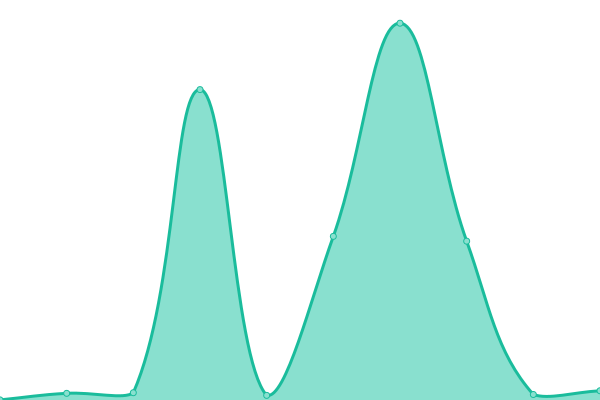
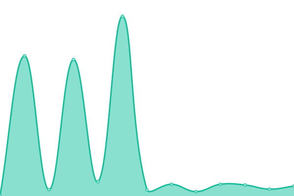

# [📈 Live Status](https://Travelonux.github.io/upptime): <!--live status--> **🟧 Partial outage**

This repository contains the open-source uptime monitor and status page for [Travelonux - CORPOIT S.A](https://www.travelonux.com/), powered by [Upptime](https://github.com/upptime/upptime).

With [Upptime](https://upptime.js.org), you can get your own unlimited and free uptime monitor and status page, powered entirely by a GitHub repository. We use [Issues](https://github.com/Travelonux/upptime/issues) as incident reports, [Actions](https://github.com/Travelonux/upptime/actions) as uptime monitors, and [Pages](https://Travelonux.github.io/upptime) for the status page.

<!--start: status pages-->
<!-- This summary is generated by Upptime (https://github.com/upptime/upptime) -->
<!-- Do not edit this manually, your changes will be overwritten -->
<!-- prettier-ignore -->
| URL | Status | History | Response Time | Uptime |
| --- | ------ | ------- | ------------- | ------ |
|  [Landing](https://travelonux.com) | 🟩 Up | [landing.yml](https://github.com/Travelonux/upptime/commits/HEAD/history/landing.yml) | 

 1348ms
     
 | 

<a href="https://sites-status.travelonux.com/history/landing">98.45%</a>
    

|  [MeVuelo](https://www.mevuelo.com) | 🟩 Up | [me-vuelo.yml](https://github.com/Travelonux/upptime/commits/HEAD/history/me-vuelo.yml) | 

 143ms
     
 | 

<a href="https://sites-status.travelonux.com/history/me-vuelo">100.00%</a>
    

|  [MeVuelo UY](https://www.mevuelo.com.uy) | 🟩 Up | [me-vuelo-uy.yml](https://github.com/Travelonux/upptime/commits/HEAD/history/me-vuelo-uy.yml) | 

 408ms
     
 | 

<a href="https://sites-status.travelonux.com/history/me-vuelo-uy">100.00%</a>
    

|  [Admin MeVuelo UY](https://admin.mevuelo.com.uy) | 🟩 Up | [admin-me-vuelo-uy.yml](https://github.com/Travelonux/upptime/commits/HEAD/history/admin-me-vuelo-uy.yml) | 

 303ms
     
 | 

<a href="https://sites-status.travelonux.com/history/admin-me-vuelo-uy">100.00%</a>
    

|  [MeVuelo PY](https://www.mevuelo.com.py) | 🟩 Up | [me-vuelo-py.yml](https://github.com/Travelonux/upptime/commits/HEAD/history/me-vuelo-py.yml) | 

 263ms
     
 | 

<a href="https://sites-status.travelonux.com/history/me-vuelo-py">100.00%</a>
    

|  [Admin MeVuelo PY](https://admin.mevuelo.com.py) | 🟩 Up | [admin-me-vuelo-py.yml](https://github.com/Travelonux/upptime/commits/HEAD/history/admin-me-vuelo-py.yml) | 

 214ms
     
 | 

<a href="https://sites-status.travelonux.com/history/admin-me-vuelo-py">100.00%</a>
    

|  [MeVuelo BO](https://www.mevuelo.com.bo) | 🟩 Up | [me-vuelo-bo.yml](https://github.com/Travelonux/upptime/commits/HEAD/history/me-vuelo-bo.yml) | 

 1391ms
     
 | 

<a href="https://sites-status.travelonux.com/history/me-vuelo-bo">100.00%</a>
    

|  [MeVuelo Core API](https://api-mevuelo-core.travelonux.com/status) | 🟩 Up | [me-vuelo-core-api.yml](https://github.com/Travelonux/upptime/commits/HEAD/history/me-vuelo-core-api.yml) | 

 823ms
     
 | 

<a href="https://sites-status.travelonux.com/history/me-vuelo-core-api">100.00%</a>
    

|  [MeVuelo Flights API](https://api-mevuelo-flights.travelonux.com/status) | 🟩 Up | [me-vuelo-flights-api.yml](https://github.com/Travelonux/upptime/commits/HEAD/history/me-vuelo-flights-api.yml) | 

 629ms
     
 | 

<a href="https://sites-status.travelonux.com/history/me-vuelo-flights-api">99.83%</a>
    

|  [MeVuelo Hotels API](https://api-mevuelo-hotels.travelonux.com/status) | 🟩 Up | [me-vuelo-hotels-api.yml](https://github.com/Travelonux/upptime/commits/HEAD/history/me-vuelo-hotels-api.yml) | 

 636ms
     
 | 

<a href="https://sites-status.travelonux.com/history/me-vuelo-hotels-api">99.83%</a>
    

|  [MeVuelo Packages API](https://api-mevuelo-packages.travelonux.com/status) | 🟩 Up | [me-vuelo-packages-api.yml](https://github.com/Travelonux/upptime/commits/HEAD/history/me-vuelo-packages-api.yml) | 

 663ms
     
 | 

<a href="https://sites-status.travelonux.com/history/me-vuelo-packages-api">100.00%</a>
    

|  [MeVuelo Destinations API](https://mevuelo-destinations-cms.travelonux.com) | 🟩 Up | [me-vuelo-destinations-api.yml](https://github.com/Travelonux/upptime/commits/HEAD/history/me-vuelo-destinations-api.yml) | 

 656ms
     
 | 

<a href="https://sites-status.travelonux.com/history/me-vuelo-destinations-api">100.00%</a>
    

|  [MeVuelo Packages Availability (MVD - Mobile)](https://api-mevuelo-packages.travelonux.com/v1/mevuelo/frontend/packages/healthcheck?departure=MVD&api_key=60f8b35a-2e1e-48d3-939f-41dece9aa5d4&resolution=1) | 🟩 Up | [me-vuelo-packages-availability-mvd-mobile.yml](https://github.com/Travelonux/upptime/commits/HEAD/history/me-vuelo-packages-availability-mvd-mobile.yml) | 

 168ms
     
 | 

<a href="https://sites-status.travelonux.com/history/me-vuelo-packages-availability-mvd-mobile">100.00%</a>
    

|  [MeVuelo Packages Availability (ASU - Mobile)](https://api-mevuelo-packages.travelonux.com/v1/mevuelo/frontend/packages/healthcheck?departure=ASU&api_key=ebfc5bcd-c798-4a53-a45a-5118f8a1e377&resolution=1) | 🟩 Up | [me-vuelo-packages-availability-asu-mobile.yml](https://github.com/Travelonux/upptime/commits/HEAD/history/me-vuelo-packages-availability-asu-mobile.yml) | 

 171ms
     
 | 

<a href="https://sites-status.travelonux.com/history/me-vuelo-packages-availability-asu-mobile">100.00%</a>
    

|  [MeVuelo UY Testing](https://mv-uruguay-testing.travelonux.com/) | 🟩 Up | [me-vuelo-uy-testing.yml](https://github.com/Travelonux/upptime/commits/HEAD/history/me-vuelo-uy-testing.yml) | 

 247ms
     
 | 

<a href="https://sites-status.travelonux.com/history/me-vuelo-uy-testing">100.00%</a>
    

|  [Admin MeVuelo UY Testing](https://admin-mv-uruguay-testing.travelonux.com/) | 🟩 Up | [admin-me-vuelo-uy-testing.yml](https://github.com/Travelonux/upptime/commits/HEAD/history/admin-me-vuelo-uy-testing.yml) | 

 159ms
     
 | 

<a href="https://sites-status.travelonux.com/history/admin-me-vuelo-uy-testing">100.00%</a>
    

|  [MeVuelo PY Testing](https://mv-paraguay-testing.travelonux.com/) | 🟩 Up | [me-vuelo-py-testing.yml](https://github.com/Travelonux/upptime/commits/HEAD/history/me-vuelo-py-testing.yml) | 

 217ms
     
 | 

<a href="https://sites-status.travelonux.com/history/me-vuelo-py-testing">100.00%</a>
    

|  [Admin MeVuelo PY Testing](https://admin-mv-paraguay-testing.travelonux.com/) | 🟩 Up | [admin-me-vuelo-py-testing.yml](https://github.com/Travelonux/upptime/commits/HEAD/history/admin-me-vuelo-py-testing.yml) | 

 121ms
     
 | 

<a href="https://sites-status.travelonux.com/history/admin-me-vuelo-py-testing">100.00%</a>
    

|  [MeVuelo BO Testing](https://mv-bolivia-testing.travelonux.com/) | 🟩 Up | [me-vuelo-bo-testing.yml](https://github.com/Travelonux/upptime/commits/HEAD/history/me-vuelo-bo-testing.yml) | 

 235ms
     
 | 

<a href="https://sites-status.travelonux.com/history/me-vuelo-bo-testing">100.00%</a>
    

|  [Admin MeVuelo BO Testing](https://admin-mv-bolivia-testing.travelonux.com/) | 🟩 Up | [admin-me-vuelo-bo-testing.yml](https://github.com/Travelonux/upptime/commits/HEAD/history/admin-me-vuelo-bo-testing.yml) | 

 120ms
     
 | 

<a href="https://sites-status.travelonux.com/history/admin-me-vuelo-bo-testing">100.00%</a>
    

|  [MeVuelo Core API Testing](https://api-mevuelo-testing.travelonux.com/status) | 🟥 Down | [me-vuelo-core-api-testing.yml](https://github.com/Travelonux/upptime/commits/HEAD/history/me-vuelo-core-api-testing.yml) | 

 252ms
     
 | 

<a href="https://sites-status.travelonux.com/history/me-vuelo-core-api-testing">94.24%</a>
    

|  [MeVuelo Flights API Testing](https://api-mevuelo-flights-testing.travelonux.com/status) | 🟥 Down | [me-vuelo-flights-api-testing.yml](https://github.com/Travelonux/upptime/commits/HEAD/history/me-vuelo-flights-api-testing.yml) | 

 428ms
     
 | 

<a href="https://sites-status.travelonux.com/history/me-vuelo-flights-api-testing">94.80%</a>
    

|  [MeVuelo Hotels API Testing](https://api-mevuelo-hotels-testing.travelonux.com/status) | 🟥 Down | [me-vuelo-hotels-api-testing.yml](https://github.com/Travelonux/upptime/commits/HEAD/history/me-vuelo-hotels-api-testing.yml) | 

 602ms
     
 | 

<a href="https://sites-status.travelonux.com/history/me-vuelo-hotels-api-testing">94.84%</a>
    

|  [MeVuelo Packages API Testing](https://api-mevuelo-packages-testing.travelonux.com/status) | 🟥 Down | [me-vuelo-packages-api-testing.yml](https://github.com/Travelonux/upptime/commits/HEAD/history/me-vuelo-packages-api-testing.yml) | 

 1258ms
     
 | 

<a href="https://sites-status.travelonux.com/history/me-vuelo-packages-api-testing">95.24%</a>
    

|  [MeVuelo Packages Availability (MVD - Mobile) Testing](https://api-mevuelo-packages-testing.travelonux.com/v1/mevuelo/frontend/packages/healthcheck?departure=MVD&api_key=60f8b35a-2e1e-48d3-939f-41dece9aa5d4&resolution=1) | 🟥 Down | [me-vuelo-packages-availability-mvd-mobile-testing.yml](https://github.com/Travelonux/upptime/commits/HEAD/history/me-vuelo-packages-availability-mvd-mobile-testing.yml) | 

 2565ms
     
 | 

<a href="https://sites-status.travelonux.com/history/me-vuelo-packages-availability-mvd-mobile-testing">95.20%</a>
    

|  [MeVuelo Packages Availability (ASU - Mobile) Testing](https://api-mevuelo-packages-testing.travelonux.com/v1/mevuelo/frontend/packages/healthcheck?departure=ASU&api_key=ebfc5bcd-c798-4a53-a45a-5118f8a1e377&resolution=1) | 🟥 Down | [me-vuelo-packages-availability-asu-mobile-testing.yml](https://github.com/Travelonux/upptime/commits/HEAD/history/me-vuelo-packages-availability-asu-mobile-testing.yml) | 

 488ms
     
 | 

<a href="https://sites-status.travelonux.com/history/me-vuelo-packages-availability-asu-mobile-testing">95.12%</a>
    

|  [Bus Turístico](https://www.busturisticomontevideo.com.uy) | 🟩 Up | [bus-turistico.yml](https://github.com/Travelonux/upptime/commits/HEAD/history/bus-turistico.yml) | 

 1267ms
     
 | 

<a href="https://sites-status.travelonux.com/history/bus-turistico">100.00%</a>
    

|  [Bus Turístico Admin](https://admin-busturistico.travelonux.com) | 🟩 Up | [bus-turistico-admin.yml](https://github.com/Travelonux/upptime/commits/HEAD/history/bus-turistico-admin.yml) | 

 785ms
     
 | 

<a href="https://sites-status.travelonux.com/history/bus-turistico-admin">100.00%</a>
    

|  [Hk-Viajes](https://www.hkviajes.com) | 🟩 Up | [hk-viajes.yml](https://github.com/Travelonux/upptime/commits/HEAD/history/hk-viajes.yml) | 

 819ms
     
 | 

<a href="https://sites-status.travelonux.com/history/hk-viajes">100.00%</a>
    

|  [Hk-Viajes Admin](https://admin-hkviajes.travelonux.com) | 🟩 Up | [hk-viajes-admin.yml](https://github.com/Travelonux/upptime/commits/HEAD/history/hk-viajes-admin.yml) | 

 766ms
     
 | 

<a href="https://sites-status.travelonux.com/history/hk-viajes-admin">100.00%</a>
    

|  [Me Quedo Acá (DEMOS)](https://mequedoaca.travelonux.com) | 🟩 Up | [me-quedo-aca-demos.yml](https://github.com/Travelonux/upptime/commits/HEAD/history/me-quedo-aca-demos.yml) | 

 811ms
     
 | 

<a href="https://sites-status.travelonux.com/history/me-quedo-aca-demos">100.00%</a>
    

|  [Me Quedo Acá Admin (DEMOS)](https://admin-mequedoaca.travelonux.com) | 🟩 Up | [me-quedo-aca-admin-demos.yml](https://github.com/Travelonux/upptime/commits/HEAD/history/me-quedo-aca-admin-demos.yml) | 

 786ms
     
 | 

<a href="https://sites-status.travelonux.com/history/me-quedo-aca-admin-demos">100.00%</a>
    

|  [Agencys API](https://api-agencys.travelonux.com/status) | 🟩 Up | [agencys-api.yml](https://github.com/Travelonux/upptime/commits/HEAD/history/agencys-api.yml) | 

 757ms
     
 | 

<a href="https://sites-status.travelonux.com/history/agencys-api">100.00%</a>
    

|  [Delta ARG/UY](https://www.deltaargentinauruguay.com) | 🟩 Up | [delta-arg-uy.yml](https://github.com/Travelonux/upptime/commits/HEAD/history/delta-arg-uy.yml) | 

 748ms
     
 | 

<a href="https://sites-status.travelonux.com/history/delta-arg-uy">100.00%</a>
    

|  [Delta ARG/UY Admin](https://admin-delta.travelonux.com) | 🟩 Up | [delta-arg-uy-admin.yml](https://github.com/Travelonux/upptime/commits/HEAD/history/delta-arg-uy-admin.yml) | 

 803ms
     
 | 

<a href="https://sites-status.travelonux.com/history/delta-arg-uy-admin">100.00%</a>
    

|  [Delta API](https://api-delta.travelonux.com/status) | 🟩 Up | [delta-api.yml](https://github.com/Travelonux/upptime/commits/HEAD/history/delta-api.yml) | 

 756ms
     
 | 

<a href="https://sites-status.travelonux.com/history/delta-api">100.00%</a>
    

|  [EGA-Keguay](https://egakeguay.com) | 🟩 Up | [ega-keguay.yml](https://github.com/Travelonux/upptime/commits/HEAD/history/ega-keguay.yml) | 

 534ms
     
 | 

<a href="https://sites-status.travelonux.com/history/ega-keguay">100.00%</a>
    

|  [EGA-Keguay Admin](https://admin.egakeguay.com) | 🟩 Up | [ega-keguay-admin.yml](https://github.com/Travelonux/upptime/commits/HEAD/history/ega-keguay-admin.yml) | 

 523ms
     
 | 

<a href="https://sites-status.travelonux.com/history/ega-keguay-admin">100.00%</a>
    

|  [EGA Core API](https://ega-core-api.travelonux.com/status) | 🟩 Up | [ega-core-api.yml](https://github.com/Travelonux/upptime/commits/HEAD/history/ega-core-api.yml) | 

 503ms
     
 | 

<a href="https://sites-status.travelonux.com/history/ega-core-api">100.00%</a>
    

|  [EGA Excursions API](https://ega-excursions-api.travelonux.com/status) | 🟩 Up | [ega-excursions-api.yml](https://github.com/Travelonux/upptime/commits/HEAD/history/ega-excursions-api.yml) | 

 506ms
     
 | 

<a href="https://sites-status.travelonux.com/history/ega-excursions-api">100.00%</a>
    

<!--end: status pages-->

[**Visit our status website →**](https://Travelonux.github.io/upptime)

## 📄 License

- Powered by: [Upptime](https://github.com/upptime/upptime)
- Code: [MIT](./LICENSE) © [Travelonux - CORPOIT S.A](https://www.travelonux.com/)
- Data in the `./history` directory: [Open Database License](https://opendatacommons.org/licenses/odbl/1-0/)
