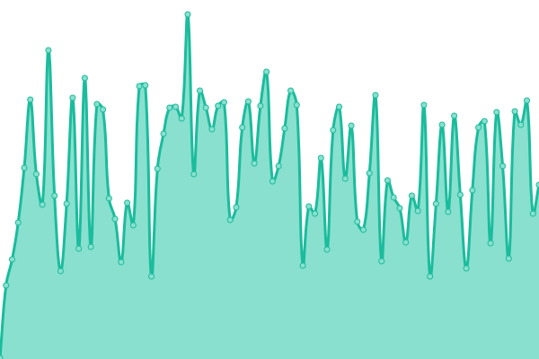
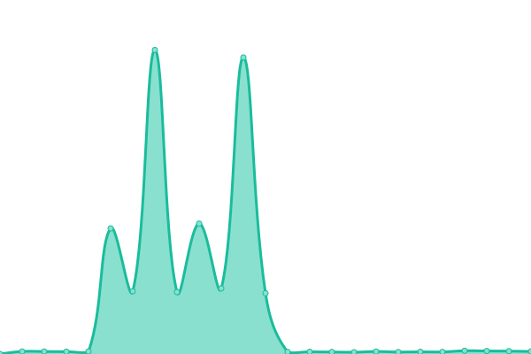

# [📈 Live Status](https://Travelonux.github.io/upptime): <!--live status--> **🟧 Partial outage**

This repository contains the open-source uptime monitor and status page for [Travelonux - CORPOIT S.A](https://www.travelonux.com/), powered by [Upptime](https://github.com/upptime/upptime).

With [Upptime](https://upptime.js.org), you can get your own unlimited and free uptime monitor and status page, powered entirely by a GitHub repository. We use [Issues](https://github.com/Travelonux/upptime/issues) as incident reports, [Actions](https://github.com/Travelonux/upptime/actions) as uptime monitors, and [Pages](https://Travelonux.github.io/upptime) for the status page.

<!--start: status pages-->
<!-- This summary is generated by Upptime (https://github.com/upptime/upptime) -->
<!-- Do not edit this manually, your changes will be overwritten -->
<!-- prettier-ignore -->
| URL | Status | History | Response Time | Uptime |
| --- | ------ | ------- | ------------- | ------ |
|  [Landing](https://travelonux.com) | 🟩 Up | [landing.yml](https://github.com/Travelonux/upptime/commits/HEAD/history/landing.yml) | 

 490ms
     
 | 

<a href="https://sites-status.travelonux.com/history/landing">99.57%</a>
    

|  [MeVuelo](https://www.mevuelo.com) | 🟩 Up | [me-vuelo.yml](https://github.com/Travelonux/upptime/commits/HEAD/history/me-vuelo.yml) | 

 139ms
     
 | 

<a href="https://sites-status.travelonux.com/history/me-vuelo">100.00%</a>
    

|  [MeVuelo UY](https://www.mevuelo.com.uy) | 🟩 Up | [me-vuelo-uy.yml](https://github.com/Travelonux/upptime/commits/HEAD/history/me-vuelo-uy.yml) | 

 324ms
     
 | 

<a href="https://sites-status.travelonux.com/history/me-vuelo-uy">100.00%</a>
    

|  [Admin MeVuelo UY](https://admin.mevuelo.com.uy) | 🟩 Up | [admin-me-vuelo-uy.yml](https://github.com/Travelonux/upptime/commits/HEAD/history/admin-me-vuelo-uy.yml) | 

 347ms
     
 | 

<a href="https://sites-status.travelonux.com/history/admin-me-vuelo-uy">100.00%</a>
    

|  [MeVuelo UY (testing)](https://mv-uruguay-testing.travelonux.com) | 🟩 Up | [me-vuelo-uy-testing.yml](https://github.com/Travelonux/upptime/commits/HEAD/history/me-vuelo-uy-testing.yml) | 

 114ms
     
 | 

<a href="https://sites-status.travelonux.com/history/me-vuelo-uy-testing">100.00%</a>
    

|  [Admin MeVuelo UY (testing)](https://admin-mv-uruguay-testing.travelonux.com) | 🟩 Up | [admin-me-vuelo-uy-testing.yml](https://github.com/Travelonux/upptime/commits/HEAD/history/admin-me-vuelo-uy-testing.yml) | 

 128ms
     
 | 

<a href="https://sites-status.travelonux.com/history/admin-me-vuelo-uy-testing">100.00%</a>
    

|  [MeVuelo PY](https://www.mevuelo.com.py) | 🟩 Up | [me-vuelo-py.yml](https://github.com/Travelonux/upptime/commits/HEAD/history/me-vuelo-py.yml) | 

 148ms
     
 | 

<a href="https://sites-status.travelonux.com/history/me-vuelo-py">100.00%</a>
    

|  [Admin MeVuelo PY](https://admin.mevuelo.com.py) | 🟩 Up | [admin-me-vuelo-py.yml](https://github.com/Travelonux/upptime/commits/HEAD/history/admin-me-vuelo-py.yml) | 

 667ms
     
 | 

<a href="https://sites-status.travelonux.com/history/admin-me-vuelo-py">100.00%</a>
    

|  [MeVuelo PY (testing)](https://mv-paraguay-testing.travelonux.com) | 🟩 Up | [me-vuelo-py-testing.yml](https://github.com/Travelonux/upptime/commits/HEAD/history/me-vuelo-py-testing.yml) | 

 124ms
     
 | 

<a href="https://sites-status.travelonux.com/history/me-vuelo-py-testing">100.00%</a>
    

|  [Admin MeVuelo PY(testing)](https://admin-mv-paraguay-testing.travelonux.com) | 🟩 Up | [admin-me-vuelo-py-testing.yml](https://github.com/Travelonux/upptime/commits/HEAD/history/admin-me-vuelo-py-testing.yml) | 

 117ms
     
 | 

<a href="https://sites-status.travelonux.com/history/admin-me-vuelo-py-testing">100.00%</a>
    

|  [MeVuelo BO](https://www.mevuelo.com.bo) | 🟩 Up | [me-vuelo-bo.yml](https://github.com/Travelonux/upptime/commits/HEAD/history/me-vuelo-bo.yml) | 

 288ms
     
 | 

<a href="https://sites-status.travelonux.com/history/me-vuelo-bo">100.00%</a>
    

|  [Admin MeVuelo BO](https://admin.mevuelo.com.bo) | 🟩 Up | [admin-me-vuelo-bo.yml](https://github.com/Travelonux/upptime/commits/HEAD/history/admin-me-vuelo-bo.yml) | 

 346ms
     
 | 

<a href="https://sites-status.travelonux.com/history/admin-me-vuelo-bo">100.00%</a>
    

|  [MeVuelo BO (testing)](https://mv-bolivia-testing.travelonux.com) | 🟩 Up | [me-vuelo-bo-testing.yml](https://github.com/Travelonux/upptime/commits/HEAD/history/me-vuelo-bo-testing.yml) | 

 173ms
     
 | 

<a href="https://sites-status.travelonux.com/history/me-vuelo-bo-testing">100.00%</a>
    

|  [Admin MeVuelo BO(testing)](https://admin-mv-bolivia-testing.travelonux.com) | 🟩 Up | [admin-me-vuelo-bo-testing.yml](https://github.com/Travelonux/upptime/commits/HEAD/history/admin-me-vuelo-bo-testing.yml) | 

 140ms
     
 | 

<a href="https://sites-status.travelonux.com/history/admin-me-vuelo-bo-testing">100.00%</a>
    

|  [MeVuelo CO](https://www.mevuelo.com.co) | 🟩 Up | [me-vuelo-co.yml](https://github.com/Travelonux/upptime/commits/HEAD/history/me-vuelo-co.yml) | 

 120ms
     
 | 

<a href="https://sites-status.travelonux.com/history/me-vuelo-co">100.00%</a>
    

|  [Admin MeVuelo CO](https://admin.mevuelo.com.co) | 🟩 Up | [admin-me-vuelo-co.yml](https://github.com/Travelonux/upptime/commits/HEAD/history/admin-me-vuelo-co.yml) | 

 69ms
     
 | 

<a href="https://sites-status.travelonux.com/history/admin-me-vuelo-co">100.00%</a>
    

|  [MeVuelo CO (testing)](https://mv-colombia-testing.travelonux.com) | 🟩 Up | [me-vuelo-co-testing.yml](https://github.com/Travelonux/upptime/commits/HEAD/history/me-vuelo-co-testing.yml) | 

 805ms
     
 | 

<a href="https://sites-status.travelonux.com/history/me-vuelo-co-testing">100.00%</a>
    

|  [Admin MeVuelo CO (testing)](https://admin-mv-colombia-testing.travelonux.com) | 🟩 Up | [admin-me-vuelo-co-testing.yml](https://github.com/Travelonux/upptime/commits/HEAD/history/admin-me-vuelo-co-testing.yml) | 

 181ms
     
 | 

<a href="https://sites-status.travelonux.com/history/admin-me-vuelo-co-testing">100.00%</a>
    

|  [Power (production)](https://power.mevuelo.com) | 🟩 Up | [power-production.yml](https://github.com/Travelonux/upptime/commits/HEAD/history/power-production.yml) | 

 539ms
     
 | 

<a href="https://sites-status.travelonux.com/history/power-production">100.00%</a>
    

|  [Power (testing)](https://power-testing.travelonux.com) | 🟩 Up | [power-testing.yml](https://github.com/Travelonux/upptime/commits/HEAD/history/power-testing.yml) | 

 148ms
     
 | 

<a href="https://sites-status.travelonux.com/history/power-testing">100.00%</a>
    

|  [MeVuelo Core API (production) EKS](https://api.core.mevuelo.com/status) | 🟩 Up | [me-vuelo-core-api-production-eks.yml](https://github.com/Travelonux/upptime/commits/HEAD/history/me-vuelo-core-api-production-eks.yml) | 

 212ms
     
 | 

<a href="https://sites-status.travelonux.com/history/me-vuelo-core-api-production-eks">100.00%</a>
    

|  [MeVuelo Flights API (production) EKS](https://api.flights.mevuelo.com/status) | 🟩 Up | [me-vuelo-flights-api-production-eks.yml](https://github.com/Travelonux/upptime/commits/HEAD/history/me-vuelo-flights-api-production-eks.yml) | 

 229ms
     
 | 

<a href="https://sites-status.travelonux.com/history/me-vuelo-flights-api-production-eks">100.00%</a>
    

|  [MeVuelo Hotels API (production) EKS](https://api.hotels.mevuelo.com/status) | 🟩 Up | [me-vuelo-hotels-api-production-eks.yml](https://github.com/Travelonux/upptime/commits/HEAD/history/me-vuelo-hotels-api-production-eks.yml) | 

 194ms
     
 | 

<a href="https://sites-status.travelonux.com/history/me-vuelo-hotels-api-production-eks">100.00%</a>
    

|  [MeVuelo Hotels Proxy API (production) EKS](https://api.hotels-proxy.mevuelo.com/status) | 🟩 Up | [me-vuelo-hotels-proxy-api-production-eks.yml](https://github.com/Travelonux/upptime/commits/HEAD/history/me-vuelo-hotels-proxy-api-production-eks.yml) | 

 185ms
     
 | 

<a href="https://sites-status.travelonux.com/history/me-vuelo-hotels-proxy-api-production-eks">100.00%</a>
    

|  [MeVuelo Packages API (production) EKS](https://api.packages.mevuelo.com/status) | 🟩 Up | [me-vuelo-packages-api-production-eks.yml](https://github.com/Travelonux/upptime/commits/HEAD/history/me-vuelo-packages-api-production-eks.yml) | 

 204ms
     
 | 

<a href="https://sites-status.travelonux.com/history/me-vuelo-packages-api-production-eks">100.00%</a>
    

|  [MeVuelo CRM API (production) EKS](https://api.crm.mevuelo.com/healthcheck) | 🟩 Up | [me-vuelo-crm-api-production-eks.yml](https://github.com/Travelonux/upptime/commits/HEAD/history/me-vuelo-crm-api-production-eks.yml) | 

 1403ms
     
 | 

<a href="https://sites-status.travelonux.com/history/me-vuelo-crm-api-production-eks">100.00%</a>
    

|  [MeVuelo Destinations API (production) EKS](https://destinations-cms.mevuelo.com) | 🟩 Up | [me-vuelo-destinations-api-production-eks.yml](https://github.com/Travelonux/upptime/commits/HEAD/history/me-vuelo-destinations-api-production-eks.yml) | 

 186ms
     
 | 

<a href="https://sites-status.travelonux.com/history/me-vuelo-destinations-api-production-eks">100.00%</a>
    

|  [MeVuelo Core API (testing) EKS](https://api.core.eks.testing.travelonux.com/status) | 🟥 Down | [me-vuelo-core-api-testing-eks.yml](https://github.com/Travelonux/upptime/commits/HEAD/history/me-vuelo-core-api-testing-eks.yml) | 

 0ms
     
 | 

<a href="https://sites-status.travelonux.com/history/me-vuelo-core-api-testing-eks">0.00%</a>
    

|  [MeVuelo Flights API (testing) EKS](https://api.flights.eks.testing.travelonux.com/status) | 🟥 Down | [me-vuelo-flights-api-testing-eks.yml](https://github.com/Travelonux/upptime/commits/HEAD/history/me-vuelo-flights-api-testing-eks.yml) | 

 0ms
     
 | 

<a href="https://sites-status.travelonux.com/history/me-vuelo-flights-api-testing-eks">0.00%</a>
    

|  [MeVuelo Hotels API (testing) EKS](https://api.hotels.eks.testing.travelonux.com/status) | 🟥 Down | [me-vuelo-hotels-api-testing-eks.yml](https://github.com/Travelonux/upptime/commits/HEAD/history/me-vuelo-hotels-api-testing-eks.yml) | 

 0ms
     
 | 

<a href="https://sites-status.travelonux.com/history/me-vuelo-hotels-api-testing-eks">0.00%</a>
    

|  [MeVuelo Hotels Proxy API (testing) EKS](https://api.hotels-proxy.eks.testing.travelonux.com/status) | 🟥 Down | [me-vuelo-hotels-proxy-api-testing-eks.yml](https://github.com/Travelonux/upptime/commits/HEAD/history/me-vuelo-hotels-proxy-api-testing-eks.yml) | 

 0ms
     
 | 

<a href="https://sites-status.travelonux.com/history/me-vuelo-hotels-proxy-api-testing-eks">0.00%</a>
    

|  [MeVuelo Packages API (testing) EKS](https://api.packages.eks.testing.travelonux.com/status) | 🟥 Down | [me-vuelo-packages-api-testing-eks.yml](https://github.com/Travelonux/upptime/commits/HEAD/history/me-vuelo-packages-api-testing-eks.yml) | 

 0ms
     
 | 

<a href="https://sites-status.travelonux.com/history/me-vuelo-packages-api-testing-eks">0.00%</a>
    

|  [MeVuelo CRM API (testing) EKS](https://api.crm.eks.testing.travelonux.com/healthcheck) | 🟥 Down | [me-vuelo-crm-api-testing-eks.yml](https://github.com/Travelonux/upptime/commits/HEAD/history/me-vuelo-crm-api-testing-eks.yml) | 

 0ms
     
 | 

<a href="https://sites-status.travelonux.com/history/me-vuelo-crm-api-testing-eks">0.00%</a>
    

|  [MeVuelo Destinations API (testing) EKS](https://destinations-cms.eks.testing.travelonux.com) | 🟥 Down | [me-vuelo-destinations-api-testing-eks.yml](https://github.com/Travelonux/upptime/commits/HEAD/history/me-vuelo-destinations-api-testing-eks.yml) | 

 0ms
     
 | 

<a href="https://sites-status.travelonux.com/history/me-vuelo-destinations-api-testing-eks">0.00%</a>
    

|  [MeVuelo Sales Order (testing) EKS](https://api.sales-order.eks.testing.travelonux.com/healthcheck) | 🟥 Down | [me-vuelo-sales-order-testing-eks.yml](https://github.com/Travelonux/upptime/commits/HEAD/history/me-vuelo-sales-order-testing-eks.yml) | 

 0ms
     
 | 

<a href="https://sites-status.travelonux.com/history/me-vuelo-sales-order-testing-eks">0.00%</a>
    

|  [MeVuelo Packages Availability (MVD - Mobile)](https://api.packages.mevuelo.com/v1/mevuelo/frontend/packages/healthcheck?departure=MVD&api_key=60f8b35a-2e1e-48d3-939f-41dece9aa5d4&resolution=1) | 🟩 Up | [me-vuelo-packages-availability-mvd-mobile.yml](https://github.com/Travelonux/upptime/commits/HEAD/history/me-vuelo-packages-availability-mvd-mobile.yml) | 

 1258ms
     
 | 

<a href="https://sites-status.travelonux.com/history/me-vuelo-packages-availability-mvd-mobile">100.00%</a>
    

|  [MeVuelo Packages Availability (TODOS - Mobile)](https://api.packages.mevuelo.com/v1/mevuelo/frontend/packages/healthcheck?departure=TODOS&api_key=60f8b35a-2e1e-48d3-939f-41dece9aa5d4&resolution=1) | 🟩 Up | [me-vuelo-packages-availability-todos-mobile.yml](https://github.com/Travelonux/upptime/commits/HEAD/history/me-vuelo-packages-availability-todos-mobile.yml) | 

 1256ms
     
 | 

<a href="https://sites-status.travelonux.com/history/me-vuelo-packages-availability-todos-mobile">100.00%</a>
    

|  [MeVuelo Packages Availability (BOG - Mobile)](https://api.packages.mevuelo.com/v1/mevuelo/frontend/packages/healthcheck?departure=BOG&api_key=fc3394e4-1c2d-11ed-861d-0242ac120002&resolution=1) | 🟩 Up | [me-vuelo-packages-availability-bog-mobile.yml](https://github.com/Travelonux/upptime/commits/HEAD/history/me-vuelo-packages-availability-bog-mobile.yml) | 

 365ms
     
 | 

<a href="https://sites-status.travelonux.com/history/me-vuelo-packages-availability-bog-mobile">100.00%</a>
    

|  [MeVuelo Packages Availability (TODOS - Mobile)](https://api.packages.mevuelo.com/v1/mevuelo/frontend/packages/healthcheck?departure=TODOS&api_key=fc3394e4-1c2d-11ed-861d-0242ac120002&resolution=1) | 🟩 Up | [me-vuelo-packages-availability-todos-mobile.yml](https://github.com/Travelonux/upptime/commits/HEAD/history/me-vuelo-packages-availability-todos-mobile.yml) | 

 1256ms
     
 | 

<a href="https://sites-status.travelonux.com/history/me-vuelo-packages-availability-todos-mobile">100.00%</a>
    

|  [MeVuelo Packages Availability (ASU - Mobile)](https://api.packages.mevuelo.com/v1/mevuelo/frontend/packages/healthcheck?departure=ASU&api_key=ebfc5bcd-c798-4a53-a45a-5118f8a1e377&resolution=1) | 🟩 Up | [me-vuelo-packages-availability-asu-mobile.yml](https://github.com/Travelonux/upptime/commits/HEAD/history/me-vuelo-packages-availability-asu-mobile.yml) | 

 2134ms
     
 | 

<a href="https://sites-status.travelonux.com/history/me-vuelo-packages-availability-asu-mobile">100.00%</a>
    

|  [MeVuelo Packages Availability (TODOS - Mobile)](https://api.packages.mevuelo.com/v1/mevuelo/frontend/packages/healthcheck?departure=TODOS&api_key=ebfc5bcd-c798-4a53-a45a-5118f8a1e377&resolution=1) | 🟩 Up | [me-vuelo-packages-availability-todos-mobile.yml](https://github.com/Travelonux/upptime/commits/HEAD/history/me-vuelo-packages-availability-todos-mobile.yml) | 

 1256ms
     
 | 

<a href="https://sites-status.travelonux.com/history/me-vuelo-packages-availability-todos-mobile">100.00%</a>
    

|  [MeVuelo Packages Availability (VVI - Mobile)](https://api.packages.mevuelo.com/v1/mevuelo/frontend/packages/healthcheck?departure=VVI&api_key=8f41e23a-b78f-4222-83f6-803eb132ad33&resolution=1) | 🟩 Up | [me-vuelo-packages-availability-vvi-mobile.yml](https://github.com/Travelonux/upptime/commits/HEAD/history/me-vuelo-packages-availability-vvi-mobile.yml) | 

 787ms
     
 | 

<a href="https://sites-status.travelonux.com/history/me-vuelo-packages-availability-vvi-mobile">100.00%</a>
    

|  [MeVuelo Packages Availability (TODOS - Mobile)](https://api.packages.mevuelo.com/v1/mevuelo/frontend/packages/healthcheck?departure=TODOS&api_key=8f41e23a-b78f-4222-83f6-803eb132ad33&resolution=1) | 🟩 Up | [me-vuelo-packages-availability-todos-mobile.yml](https://github.com/Travelonux/upptime/commits/HEAD/history/me-vuelo-packages-availability-todos-mobile.yml) | 

 1256ms
     
 | 

<a href="https://sites-status.travelonux.com/history/me-vuelo-packages-availability-todos-mobile">100.00%</a>
    

|  [MeVuelo Packages Availability Tienda Naranja (ASU - Mobile)](https://api.packages.mevuelo.com/v1/mevuelo/frontend/packages/healthcheck?departure=ASU&api_key=6ff34ba1-d58b-4dfe-af2e-cc234c832ad0&resolution=1) | 🟩 Up | [me-vuelo-packages-availability-tienda-naranja-asu-mobile.yml](https://github.com/Travelonux/upptime/commits/HEAD/history/me-vuelo-packages-availability-tienda-naranja-asu-mobile.yml) | 

 663ms
     
 | 

<a href="https://sites-status.travelonux.com/history/me-vuelo-packages-availability-tienda-naranja-asu-mobile">100.00%</a>
    

|  [MeVuelo Packages Availability Tienda Naranja (TODOS - Mobile)](https://api.packages.mevuelo.com/v1/mevuelo/frontend/packages/healthcheck?departure=TODOS&api_key=6ff34ba1-d58b-4dfe-af2e-cc234c832ad0&resolution=1) | 🟩 Up | [me-vuelo-packages-availability-tienda-naranja-todos-mobile.yml](https://github.com/Travelonux/upptime/commits/HEAD/history/me-vuelo-packages-availability-tienda-naranja-todos-mobile.yml) | 

 665ms
     
 | 

<a href="https://sites-status.travelonux.com/history/me-vuelo-packages-availability-tienda-naranja-todos-mobile">100.00%</a>
    

<!--end: status pages-->

[**Visit our status website →**](https://Travelonux.github.io/upptime)

## 📄 License

- Powered by: [Upptime](https://github.com/upptime/upptime)
- Code: [MIT](./LICENSE) © [Travelonux - CORPOIT S.A](https://www.travelonux.com/)
- Data in the `./history` directory: [Open Database License](https://opendatacommons.org/licenses/odbl/1-0/)
